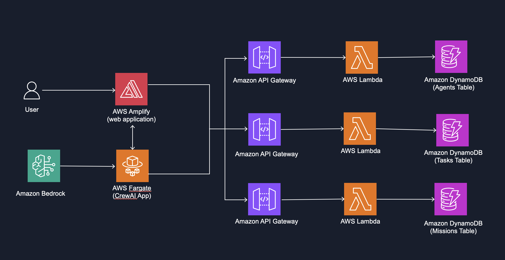

# Amazon Bedrock & CrewAI Multi-Agent Builder

This project provides a no-code platform for building and orchestrating multi-agent AI systems using Amazon Bedrock, CrewAI and foundation models like Claude 3 Haiku and Stability AI's Stable Image Ultra V1. The Multi-Agent Builder enables users to visually create, configure, and deploy specialized AI agents that collaborate to solve complex tasks - without writing a single line of code. By leveraging foundation models through a user-friendly interface, even non-technical users can harness the power of multi-agent workflows for content creation, code generation, image generation, and creative design tasks.

**Key Features:**
- **Multi-Agent Collaboration**: Agents with different roles work together to accomplish complex tasks
- **Amazon Bedrock Integration**: Leverages Amazon's foundation models for advanced AI capabilities including text generation with Claude 3 Haiku and image generation with Stability AI's Stable Image Ultra
- **CrewAI Framework**: Orchestrates agent interactions and workflow management
- **Interactive UI**: Web interface for creating, managing, and monitoring agent missions in a no-code environment
- **Serverless Architecture**: Fully deployable on AWS infrastructure

## Demo & Ready-Examples

[
](https://github.com/user-attachments/assets/2e972a60-37d7-49d4-adbc-43ab6c411276)

1. **Newsletter Creation**: Collaborative content generation with specialized agents for event ideas, copywriting, and marketing
2. **Game Code Generation**: Multi-step game development process from design prompt to functional code
3. **NPC Character Creation**: Game character development with specialized agents for character design, dialogue, attributes, and AI-generated visual representation using Stability AI's Stable Image Ultra.


## Architecture



1. Users interact with a React-based web interface to create, configure, and monitor agent missions. The UI allows no-code creation of agents with specific roles, goals, and capabilities. 
2. RESTful APIs handle communication between the UI and backend services. AWS Lambda functions process CRUD operations for agents, missions, and tasks. Amazon API Gateway manages request routing and authentication.
3. CrewAI framework coordinates agent interactions and workflow management. Agents are assigned specific roles, goals, and tools based on mission requirements. The system supports both sequential and hierarchical agent collaboration models. This app is dockerized and deployed in AWS Fargate.
4. Amazon Bedrock provides access to foundation models: Claude 3 Haiku for text generation and reasoning, and Stability AI's Stable Image Ultra for image generation. Specialized agents can access tools like code interpreters and image generators to create visual assets directly from text descriptions

## Prerequisites

1. Have the following installed:
- [AWS CDK](https://docs.aws.amazon.com/cdk/v2/guide/getting_started.html) version >= 2.1005.0
- [Node.js](https://nodejs.org/en) >= 16.x
- [npm](https://www.npmjs.com/get-npm) >= 8.x
- [Python](https://www.python.org/downloads/) >= 3.9
- [Poetry](https://python-poetry.org/docs/#installation) >= 1.4.0 for Python dependency management
- (optional) [Docker](https://www.docker.com/get-started) >= 20.10.x for local container testing only

2. In your chosen AWS Account in us-west-2, ensure that the following models are enabled in Amazon Bedrock by [adding model access](https://docs.aws.amazon.com/bedrock/latest/userguide/model-access.html#model-access-add):
   - Anthropic Claude 3 Haiku
   - Stability AI's Stable Image Ultra V1

## Project Setup

### 1. AWS Connection Setup & Context File Creation

1. Fork this repository

2. Create a GitHub [connection](https://docs.aws.amazon.com/dtconsole/latest/userguide/connections-create-github.html) for CI/CD integration in the AWS Console.

3. Configure your project by creating a `cdk.context.json` file in the root directory with the following structure (replace the placeholder values with your actual information):
   ```json
   {
     "account": "YOUR_AWS_ACCOUNT_ID",
     "region": "us-west-2",
     "connection": "YOUR_GITHUB_CONNECTION_ARN",
     "user": "YOUR_GITHUB_USERNAME",
     "repo": "sample-multi-agent-builder-bedrock-crewai",
     "branch": "main"
   }
   ```

### 2. Installing Dependencies

1. CDK Infrastructure Dependencies (package.json at root)

   ```bash
   npm install
   ```

2. Install dependencies and build UI:

   ```bash
   cd ui
   npm install
   npm run build
   ```

3. Install Python dependencies:

   ```bash
   cd ../agents-api
   poetry install
   ```

### 3. Project Deployment

1. Bootstrap your AWS environment if not already done. You will need to complete this step if it is your first time deploying a CDK project in your account:

   ```bash
   cdk bootstrap
   ```

2. Build Cloudformation Stacks (Note: make sure you're at the root)

   ```bash
   npm run build
   cdk deploy
   ```

3. (No action required here, fyi) You will see a new CloudFormation Stack called `MultiAgentToolchainStack` created in your AWS Account. Once it is successfully created, it provisions a CodePipeline called `MultiAgentProjectPipeline` which will deploy the infrastructure including backend APIs and UI. When the pipeline completes, you can find these resources in a newly created CloudFormation Stack called `Deploy-MultiAgentProjectStack`.

4. To view the application, visit the `Deploy-MultiAgentProjectStack` Stack in the AWS CloudFormation Console one it is completed (~15 mins), select the Outputs Tab and click on the link generated with name `UIUrl`. 

## (optional) Local Development

You can run both the UI and API components locally for development:

1. For the UI component:

   ```bash
   cd ui
   npm start
   ```

The UI will be available at http://localhost:3000/

2. For the Crew AI App component:

   ```bash
   cd agents-api
   python3 -m venv venv
   source venv/bin/activate  # On Linux/macOS
   # OR
   .\venv\Scripts\activate   # On Windows

   poetry install
   poetry run uvicorn main:app --reload --workers 7
   ```

The API will be available at `http://127.0.0.1:8000/`

3. For Container:

To test the application in a containerized environment:

   ```bash
   # Using Docker directly
   docker build -t multi-agent:1 .
   docker run -p 8000:8000 multi-agent:1
   ```

This will build and run the container locally, making the API available at `http://localhost:8000/`

## Project Structure

- `/agents-api` - Backend API code
  - `/tools` - Custom tools for agents (image generation, code interpreter)
  - `main.py` - FastAPI application and CrewAI orchestration
- `/ui` - React frontend application
- `/infrastructure` - AWS CDK infrastructure code


## Cleanup

To remove all deployed resources from your AWS account:

1. Delete the CloudFormation stack:

   ```bash
   cdk destroy
   ```

2. Manually delete the `Deploy-MultiAgentProjectStack` from the CloudFormation console. 
3. Empty and delete the S3 bucket that starts with `multiagenttoolchainstack-`

## FAQ

1. How do I make changes to the project after initial deployment?

This project uses AWS CodePipeline for continuous integration and deployment:

- After initial deployment, any changes pushed to your repository will automatically trigger the pipeline to rebuild and redeploy the application
- The CodePipeline (`MultiAgentProjectPipeline`) handles building, testing, and deploying both frontend and backend components
- This CI/CD integration makes it easy to iterate on your code without manual redeployment steps

2. Why aren't my UI updates showing in the browser?

If UI updates are not reflecting in CloudFront, you may need to invalidate the cache:

```bash
aws cloudfront create-invalidation \
    --distribution-id YOUR_DISTRIBUTION_ID \
    --paths "/*"
```

## Security

See [CONTRIBUTING](CONTRIBUTING.md#security-issue-notifications) for more information.

## License

This library is licensed under the MIT-0 License. See the LICENSE file.

